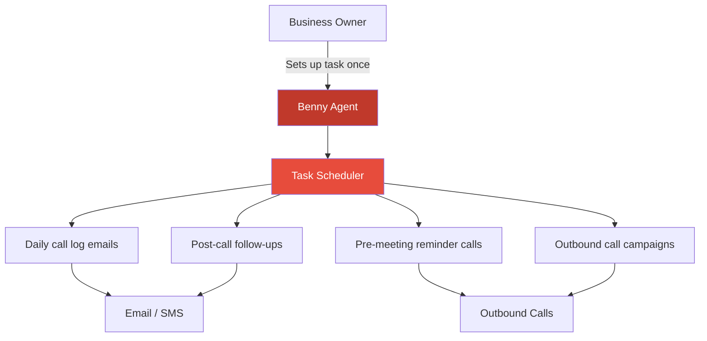

In May, [AskBenny](https://askbenny.ca/) turns one year old. What started as a scrappy AI answering service for small businesses has grown into a platform approaching half a million dollars in annual recurring revenue. Q1 2026 was a milestone quarter for us. Not because of any single breakthrough, but because everything started compounding.

## The Numbers: ~CA$40K MRR and Climbing

Our Stripe dashboard shows CA$33,447 in base MRR, but that doesn't tell the full story. Once you factor in usage overages, our actual monthly gross volume lands closer to CA$40K. March 2026 came in at CA$39,824 in gross volume, up 4.73% from the previous period.

- **Gross Monthly Volume**: ~CA$40K including overages
- **Base MRR**: CA$33,447, up steadily month over month
- **ARR**: approaching ~CA$480K when accounting for total revenue
These aren't hockey-stick numbers, and that's intentional. We're not chasing vanity metrics or burning through cash to inflate top-line revenue. We're growing at a pace that lets us stay close to our customers, keep quality high, and build a business that lasts. The curve on that MRR chart has been climbing steadily since April 2025, and we intend to keep it that way.

## The Agent Changed Everything

The biggest product win of Q1 was launching our AI agent. The impact was immediate.

Before the agent, customers had to navigate our dashboard to make changes. Update call forwarding? Find the right settings page. Change your greeting? Another page. Adjust your business hours? Yet another. For busy small business owners, even a well-designed UI adds friction when you're trying to run your day.

Now, customers just tell the agent what they want:

> *Hey, update my business hours to close at 6 PM on Fridays.*

> *Send an SMS to my client reminding them about their appointment tomorrow.*

> *Forward my calls to my cell phone for the rest of the week.*

The agent handles it. No clicking around, no searching for the right page. Just a conversation that gets things done.

The result? **Roughly 90% of our customer support volume disappeared.** People stopped reaching out to us. Not because they were frustrated, but because the agent was solving their problems faster than we ever could. That's the kind of product improvement that changes the trajectory of a company.

It's also made AskBenny stickier. When your product doesn't just answer questions but actively operates on the customer's behalf, it becomes indispensable. The feedback has been overwhelmingly positive. Customers love that they can just *ask* and it gets done.

### The Agent Remembers You

One detail that makes a huge difference: the agent saves your preferences in workspace files. Your business hours, your preferred greeting style, how you like your call summaries formatted, which team member handles which type of call. Over time, the agent builds up a picture of how you run your business.

This means interactions get faster and more personalized the longer you use it. You don't have to repeat yourself. The agent already knows your setup, your preferences, and your workflows. It feels less like talking to a tool and more like working with someone who actually understands your business.

### Scheduled Tasks: Set It and Forget It

The other major capability we shipped is scheduled tasks. Customers can tell the agent to do things on a recurring basis, and it just runs in the background.

Some real examples of what customers are doing:

> *Send me an email every morning with yesterday's call logs.*

> *I have my Google Calendar connected. Follow up with all meeting attendees 30 minutes before the meeting with an outbound call to remind them of the appointment.*

> *After every call, send the appointment summary to my office email as a PDF.*

> *Every weekday at 9 AM, run an outbound call campaign to the contacts on my collections list.*

That last one is a collections agency. They set up a daily outbound campaign and the agent handles it automatically, every single morning. A healthcare provider is using it to send appointment summaries via email after every call so their front desk always has records without lifting a finger.

These are use cases we didn't even design for. Customers across different industries are finding creative ways to put scheduled tasks to work, and new ones keep popping up. When you give people a flexible tool and get out of their way, they'll find applications you never imagined. Scheduled tasks have opened up a world of possibility and we're just scratching the surface.

## Mobile: Always On Your Home Screen

We also shipped our iOS app this quarter.

It sounds simple, but the impact on user engagement has been meaningful. Small business owners don't sit at a desk all day refreshing a web dashboard. They're on job sites, in meetings, driving between clients. Having AskBenny live on your home screen with push notifications for missed calls, new messages, and important updates means you're always connected to your business without any extra effort.

No logging in. No remembering a URL. Just open the app.

The thesis is straightforward: if your business is vital to you, the tools that run it should be as accessible as possible. An app on your phone removes friction in a way that a browser tab never can. Early adoption numbers confirm what we believed: when you make the product easier to reach, people use it more.

## Franchise Deals: The Next Growth Lever

While our core business continues to grow organically, the most exciting pipeline development is on the franchise side.

We have several franchise deals in various stages of conversation. A single franchise deal represents dozens, sometimes hundreds, of locations, each needing the same core service. It's the kind of distribution channel that could step-change our growth trajectory overnight.

We're being deliberate here. Franchise customers have different needs: centralized billing, location-specific configurations, brand consistency across hundreds of lines. We're making sure the product is ready to serve them well before we sign on the dotted line. But the conversations are real, the interest is strong, and we believe this is what unlocks the next phase.

## Still Learning, Still Iterating

A year in, and we still treat every customer conversation as a learning opportunity. Customer support isn't just a cost center for us. It's our primary feedback loop.

Every ticket that *does* come through (the 10% the agent doesn't handle) teaches us something. Maybe there's an edge case we haven't accounted for. Maybe a workflow that should be simpler. We treat these as gifts. They're signals pointing us toward the next improvement.

This mindset has kept us sharp. We ship fast, we listen carefully, and we don't let the product get stale. The businesses that rely on AskBenny are counting on us to keep getting better, and we take that seriously.

## Almost One Year

In May, we hit our one-year anniversary. It's hard to overstate how much has changed since those early days. Three co-founders, a TikTok connection, and a four-week MVP sprint.

Today we have hundreds of businesses relying on AskBenny every day, a product that's genuinely solving problems, and a growth trajectory that gives us confidence in what's ahead. The team is still lean, still hungry, and still building.

Q1 was a quarter of compounding. Revenue compounding, product value compounding, customer trust compounding. If the first year was about proving the concept, year two is about scaling it.

We're just getting started.

---

*If you're a small business owner tired of missing calls, or a franchise operator looking for an AI-powered answering solution across your locations, [get in touch](https://askbenny.ca/). We'd love to chat.*
