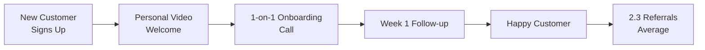

At [AskBenny](https://askbenny.ca/), we treat our first customers like investors – because they are. They're investing their trust, their business operations, and their reputation in a three-person startup. Here's how we turned that trust into our most powerful growth engine.

## The Early-Stage Customer Success Formula

Most startups think customer success starts after product-market fit. We learned it's the opposite: intense customer support _creates_ product-market fit.

Our formula:

> Extreme Support + Rapid Iteration = Evangelical Customers

## Jordan's Playbook: Making Every Customer Feel Like the Only Customer

Having Jordan dedicated to customer relations has been transformative. Here's his approach:

### The Personal Onboarding Touch

_This personal touch creates a compounding growth effect_

Every new [AskBenny](https://askbenny.ca/) customer gets:

- A personal video welcome from Jordan
- A 1-on-1 onboarding call (not a group webinar)
- His direct phone number (yes, really)
- A follow-up call after their first week

This doesn't scale? That's the point. We're not trying to scale – we're trying to learn.

### The 5-Minute Response Rule

Jordan responds to every customer message within 5 minutes during business hours. This isn't sustainable forever, but right now it creates magic:

- Customers feel heard immediately
- Problems get solved before they become frustrations
- We gather feedback in real-time

One customer told us: "I've never had a software company respond this fast. It feels like you're in the room with me."

## Turning Support into Product Development

Every customer interaction feeds our product roadmap:

### Real Example: The Voicemail Feature

**Day 1**: Customer mentions they'd like custom voicemail greetings
**Day 2**: I prototype the feature
**Day 3**: Beta version live for that customer
**Day 4**: Refined based on their feedback
**Day 5**: Rolled out to all customers

The customer didn't just get a feature – they got to shape it.

## The Compound Effect of Happy Customers

Our growth chart isn't just about our efforts. It's about our customers becoming our sales team:

- **30%** of new customers come from referrals
- **Average customer** refers 2.3 other businesses
- **NPS score**: 72 (and climbing)

These aren't just numbers – they're relationships.

## Sydney's Insight: Quality Over Quantity

Sydney's ad expertise means we could drive tons of leads. Instead, she focuses on quality:

- Target businesses that will benefit most from [AskBenny](https://askbenny.ca/)
- Pre-qualify leads before they even sign up
- Set proper expectations from the first touchpoint

This means Jordan spends time with customers who are likely to succeed, creating a virtuous cycle.

## The Technical Side of Customer Success

As the technical founder, I've built customer success into our product:

### Invisible Features That Matter

- **Auto-save everything**: Customers never lose work
- **Instant setup**: Under 3 minutes to go live
- **Smart defaults**: It works great out of the box
- **Proactive monitoring**: We fix issues before customers notice

### The Success Dashboard

We built a internal dashboard showing:

- Customer health scores
- Feature adoption rates
- Support ticket patterns
- Churn risk indicators

This lets us be proactive, not reactive.

## Hard Lessons Learned

### 1. Some Customers Aren't the Right Fit

We've refunded customers who weren't getting value. It hurt short-term but built long-term trust.

### 2. Feature Requests Aren't Commands

Listen to the problem, not the solution. Customers often suggest features when there's a simpler fix.

### 3. Speed Beats Perfection

Customers prefer a quick 80% solution over a perfect solution next month.

## The Metrics That Actually Matter

Forget vanity metrics. Here's what we track:

- **Time to First Value**: How quickly customers see results
- **Weekly Active Usage**: Are they actually using AskBenny?
- **Support Ticket Sentiment**: Are interactions positive?
- **Referral Rate**: The ultimate trust indicator

## Building a Culture of Customer Obsession

With three people, culture isn't built – it's lived:

- Every morning starts with customer feedback review
- Every feature discussion includes "what would [specific customer] think?"
- Every team member talks to customers regularly

## The Unexpected Benefits

Intense customer focus created unexpected advantages:

### Better Product Decisions

When you know your customers personally, you make better choices. We've avoided dozens of "wouldn't it be cool if" features because we know exactly what customers need.

### Stronger Team Morale

Nothing motivates like a customer saying your product changed their business. We share every success story.

### Competitive Moat

Competitors can copy features. They can't copy relationships.

## Scaling Without Losing the Magic

As we grow, we're documenting what makes our customer success special:

- Response time standards
- Personalization templates that don't feel templated
- Escalation paths that keep the human touch
- Automation that enhances, not replaces, human connection

## The ROI of Obsession

Our customer success investment pays for itself:

- **Lower CAC**: Referrals cost nothing
- **Higher LTV**: Happy customers stay longer
- **Faster iteration**: Direct feedback accelerates development
- **Better product**: We build what customers actually need

## Your Turn

If you're building something:

1. Talk to customers more than you think necessary
2. Respond faster than seems reasonable
3. Build relationships, not just user bases
4. Make every customer feel like your only customer

The best growth hack isn't a hack – it's genuine care for the people using your product.

---

_This concludes our series on building [AskBenny](https://askbenny.ca/). If you're a small business ready to never miss another call, or a founder wanting to exchange notes on building with customer obsession, reach out. We'd love to hear from you – and we promise to respond within 5 minutes._
