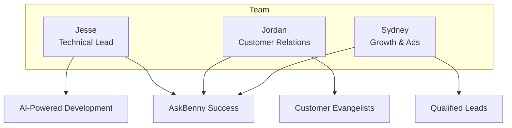

Three months ago, I was working as a software engineer at Extend. Today, I'm running a company that's hit $90K in Annual Recurring Revenue (ARR) and growing rapidly. This is the story of [AskBenny](https://askbenny.ca/) – an AI answering service that ensures small businesses never miss a call.

## The TikTok Connection That Changed Everything

It all started with a scroll through TikTok. Jordan, who would become my co-founder, posted a video about an idea: an AI-powered answering service for small businesses. The concept immediately clicked with me. Small businesses lose thousands of dollars in missed opportunities when they can't answer calls – whether they're with another customer, after hours, or simply overwhelmed.

I reached out, we connected, and within days we were building.

## From Idea to MVP in 4 Weeks

We didn't overthink it. We didn't spend months in planning. We built.

**Our Journey Timeline:**

In just four weeks, we had a working MVP that could:

- Answer calls professionally with AI
- Take messages and customer information
- Schedule callbacks
- Integrate with existing business phone systems

The speed was intentional. We knew that every day spent perfecting features was a day not spent learning from real customers.

## The Power of a Lean, Focused Team

Our team of three has been our secret weapon:

**Jordan**: Handles customer relations and onboarding. This has been absolutely crucial. In the early stages, every customer interaction shapes your product. Jordan ensures new customers feel supported from day one, turning them into advocates who promote us to others.

**Sydney**: Our ads specialist who's so effective at finding qualified leads that our customer acquisition cost remains incredibly low. Her ability to identify and target small businesses who desperately need our solution has been game-changing.

**Me**: I handle the technical side, leveraging AI tools to maintain the velocity of a much larger engineering team.

## The Numbers Don't Lie

Looking at our Stripe dashboard still feels surreal:

- **MRR**: $7,403 (Monthly Recurring Revenue)
- **Growth**: 1,769.4% in the last 3 months
- **Net Volume**: $16,345.79 processed

But these numbers tell only part of the story. What they don't show is the small business owner who can now take a vacation without worrying about missing important calls, or the contractor who's winning more jobs because every lead gets answered professionally.

## Leaving the Comfort Zone

Making the decision to leave my position at Extend wasn't easy. But seeing the traction, the customer feedback, and the potential partnerships on the horizon made it clear – this was the moment to go all-in.

This is, without question, the most fulfilling work I've ever done. Every line of code directly impacts real businesses. Every feature we ship helps someone grow their company.

## What's Next

We're just getting started. With several strategic partnerships in the pipeline, we're positioned to scale [AskBenny](https://askbenny.ca/) from a helpful tool to an essential service for millions of small businesses.

The journey from zero to $90K ARR in three months has taught us that with the right team, the right technology, and relentless focus on customer success, you can build something meaningful faster than most people think possible.

If you're a small business tired of missing calls, or if you're building something and want to connect, reach out. We're always happy to chat about how AI is transforming the way small businesses operate.

---

_Follow our journey as we scale AskBenny and share lessons learned along the way. Next up: How we're using AI to 10x our productivity as a lean startup._
