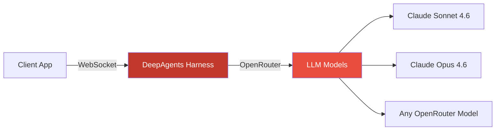
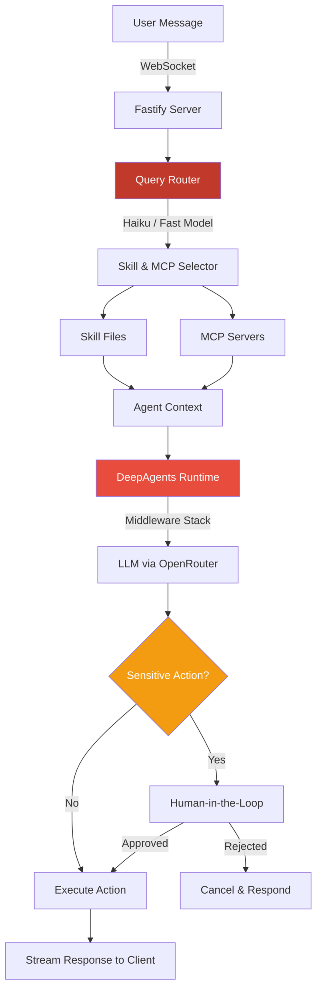
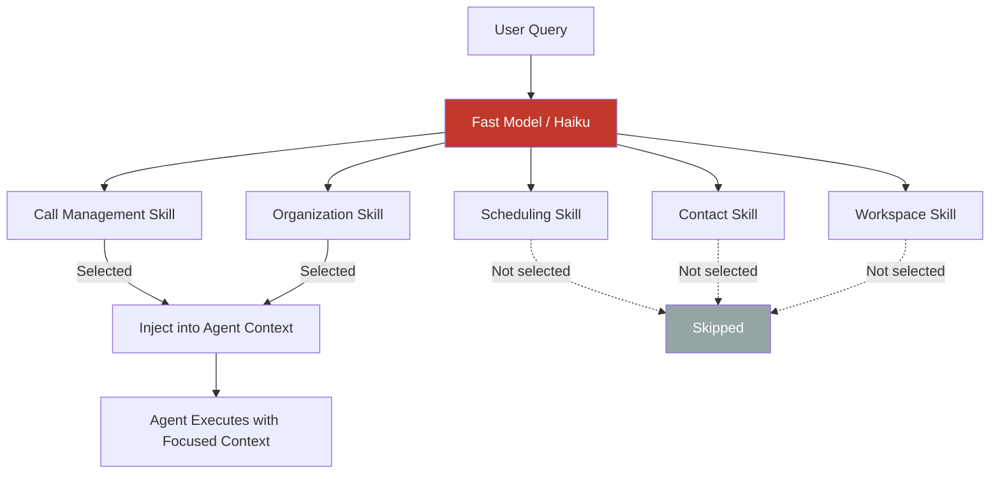
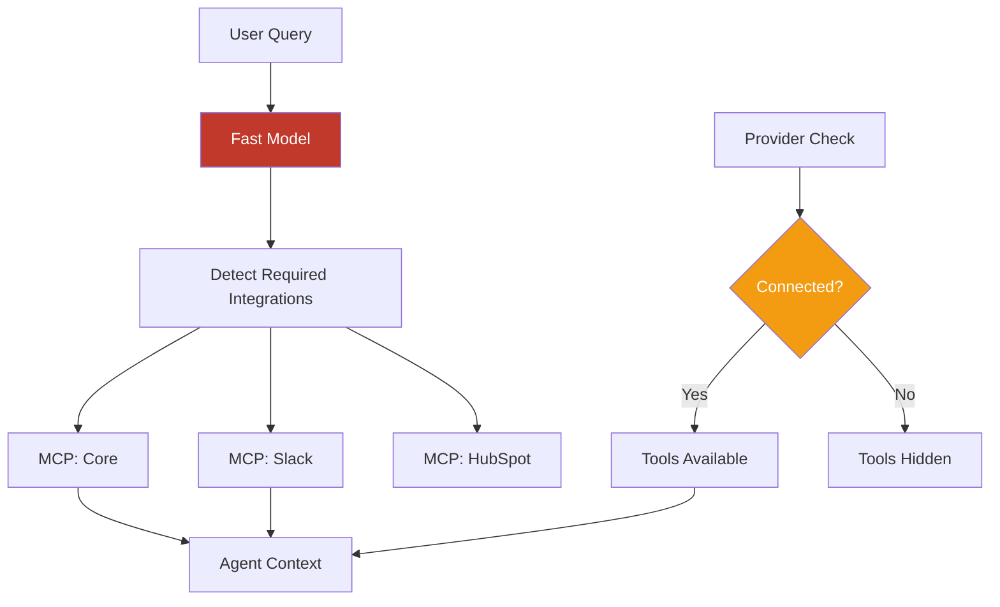
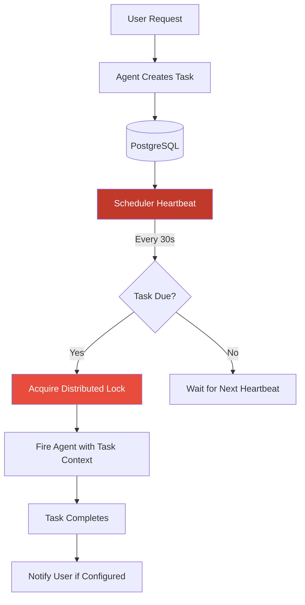
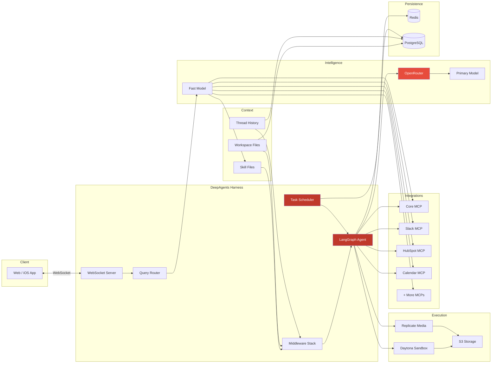

Our AI agent has become the core of how customers interact with AskBenny. Behind the scenes, it's a system we've been iterating on for months. This post breaks down how the whole thing works technically, why we made the choices we did, and what we learned along the way.

## Why LangChain DeepAgents

The first decision was which SDK to build on. The obvious choices were Anthropic's agent SDK or OpenAI's. Both are good, but both come with the same problem: vendor lock-in.

If I build directly on Claude's SDK, I'm tied to Claude. If I build on OpenAI, I'm tied to OpenAI. Models are improving fast and the landscape shifts every few months. I didn't want to be in a position where switching models meant rewriting our entire agent infrastructure.

LangChain's [DeepAgents](https://docs.langchain.com/oss/python/deepagents/overview) TypeScript SDK gave us what we needed. It's model-agnostic, composable, and the middleware system is flexible enough that we can swap out components without tearing everything apart. We pair it with [OpenRouter](https://openrouter.ai/) so we can route to any model we want. Right now we're primarily running Claude Sonnet 4.6, but we can switch to Opus or any other model with a config change.

## The Cost Reality

Opus 4.6 is the best performing model for our use case. No question. But it's expensive, and we're a startup. We're profitable, but I don't want all our margins going to API costs.

What I found is that you can get very close to Opus-level performance out of Sonnet 4.6 if you're disciplined about two things: making the right context available, and being strict with your instruction set. Our skill files are detailed and opinionated. They tell the model exactly what steps to follow, what API endpoints to hit, and what format to return results in. That structure closes the gap between Sonnet and Opus significantly.

There's a compounding effect here too. As models get better, our product gets better automatically. The constraints we put in place today to optimize for cost are also making us better at prompt engineering and context management. That knowledge carries forward regardless of which model we're running.

## Architecture Overview

Here's how a request flows through the system from start to finish:

The client app connects to our DeepAgents harness over WebSocket. This gives us real-time bidirectional communication with event buffering and transparent reconnection. If a user loses connection mid-conversation, we replay buffered events when they reconnect so nothing is lost.

We run a global concurrency limiter to prevent overload. Backpressure signals go back to the client when we're at capacity.

## The Skill System

Skills are the backbone of how the agent knows what to do. Each skill is a markdown file with frontmatter metadata and detailed instructions. Think of them like specialized playbooks.

We have skills for call management, organization settings, scheduling, contact management, and more. Each one contains:

- Step-by-step instructions for the task
- The specific API endpoints to call
- Expected input/output formats
- Edge cases and error handling guidance

When a query comes in, a fast model (Haiku) looks at the user's message and selects which skills are relevant. Only those skills get injected into the agent's context. This is critical because we found that the thinner the context window, the better the agent performs.

There are also "always-on" skills that get injected regardless of the query. These cover intent detection, caller management, and core organization operations. They're foundational enough that the agent always needs them.

The skill files are loaded into a singleton InMemoryStore on boot, so there's no filesystem reads at query time. In production, they're compiled to JSON. Per-skill loading failures are logged but non-fatal. The store degrades gracefully rather than blocking the entire agent.

## Modular MCP Servers

This is where we learned an expensive lesson early on.

We started with one MCP server that exposed every tool: Google Calendar, Notion, Slack, HubSpot, QuickBooks, Shopify, you name it. All on a single endpoint. The problem? It absolutely bloated the context window. The agent was getting hundreds of tool definitions it didn't need for any given query, and performance suffered.

So we split it up. Same repository, but each integration now has its own MCP endpoint. CRM tools get their own server. Calendar tools get their own server. Messaging, accounting, e-commerce, clinic management, all separate. We support a growing list of integrations across these domains.

The fast model doesn't just pick skills. It also determines which MCP servers the query needs. If you're asking about your call logs, it only connects the core MCP server. If you're asking the agent to post a message and update a CRM contact, it connects those two specific servers and nothing else.

We also gate MCP tools based on what providers the customer actually has connected. The agent only sees tools for services the customer has linked. No point showing e-commerce tools to someone who doesn't use an e-commerce platform.

Each MCP connection is managed with configurable reconnection (max retries, exponential backoff) and we track per-tool metrics: total calls, success rate, failure rate, average duration. This gives us observability into which tools are reliable and which need attention.

## The Middleware Stack

LangChain's middleware system is where a lot of the magic happens. We have a composable stack of middleware that processes every agent invocation. It handles things like cancellation, tool deduplication, caching, metrics, context-aware token budgeting, schema coercion, message batching, provider-based tool gating, and output validation. The order matters, and we've iterated on it quite a bit.

One pattern worth calling out: we distinguish between read-only and write operations for deduplication. Read-only tool calls can be safely deduplicated within a turn to save API calls. But write operations always execute, even if the same call was made before. You don't want to accidentally skip a real action because the agent tried it twice.

## Human-in-the-Loop

We don't let the agent do everything unsupervised. Sensitive actions require explicit user approval before they execute.

We classify tools by risk level:

- **High risk** (deleting contacts, canceling scheduled tasks): Approve or reject only. No editing.
- **Medium risk** (sending emails, sending SMS): Approve, edit the content, or reject.

When the agent hits one of these tools, execution pauses. A confirmation dialog pops up on the client showing exactly what the agent wants to do. The user reviews it, makes any edits they want, and either approves or rejects. The agent resumes based on their decision.

This was a deliberate choice. We don't want the agent going wildfire on actions that could have real consequences. A misworded SMS sent to a customer isn't something you can undo. The few seconds it takes to confirm is worth the safety.

## Workspace Files and Agent Memory

The agent saves user preferences and context in workspace files backed by PostgreSQL. This is our virtual filesystem, and the agent is very good at using it.

Over time, the workspace accumulates details about the business: preferred greeting style, business hours, how they like call summaries formatted, team member roles. The agent reads these files at the start of each session, so every interaction is personalized without the user having to repeat themselves.

We also run a proactive memory middleware that pre-loads relevant context from previous conversation threads before the agent even starts processing the new query. This reduces the need for users to re-explain things and makes the agent feel like it actually remembers your business.

Redis handles checkpointing for the conversation state itself with a TTL and refresh-on-read, so active conversations stay warm. If Redis is unavailable, we fall back to in-memory state. The system degrades gracefully rather than failing hard.

## Scheduled Tasks

Users can tell the agent to do things on a recurring basis. Under the hood, this is a distributed scheduler with a heartbeat poll loop.

Each scheduled task gets a distributed lock so we don't have duplicate executions in a multi-instance deployment. The scheduler supports configurable concurrency, graceful shutdown with a drain period, and automatic auth token refresh when tokens expire.

Tasks have configurable timeouts with continuation attempts. If a task fails, it logs the error and moves on rather than retrying in a loop. We'd rather surface the failure than silently retry something that might have side effects.

## Sandboxed Code Execution with Daytona

Sometimes the agent needs to generate files. A customer wants a CSV export of their call logs, or a PDF summary, or a chart showing their call volume trends. For this, we use [Daytona](https://daytona.io/) to sandbox code execution.

Each sandbox is scoped to an org and thread, reusable within a session, and auto-stops after a period of idle time. The agent can:

- Execute code in Python, JavaScript, TypeScript, Bash, R, or Java
- Install packages on the fly (pip or npm)
- Upload and download files within the sandbox
- Access 30+ pre-installed Python libraries (pandas, numpy, matplotlib, scikit-learn, etc.)

The sandbox comes with system tools like tesseract-ocr, ffmpeg, and poppler pre-installed, so the agent can handle OCR, video processing, and PDF manipulation without setup.

Once the agent generates a file in the sandbox, it uploads the result to our S3 storage scoped to the customer's organization. The file gets a long-lived URL that the customer can access anytime.

## Media Generation with Replicate

For image and video generation, we use [Replicate](https://replicate.com/). The agent can generate images from text prompts, edit existing images, or create short videos.

The flow is straightforward: the agent calls Replicate's prediction API, waits for the result, then immediately downloads the output and uploads it to our S3 storage. Replicate URLs expire after about an hour, so we persist everything to our own storage before that happens. Every file is scoped to the customer's organization.

## Putting It All Together

Here's the full picture of how all these systems connect:

## What We've Learned

Building this system taught us a few things worth sharing:

**Context window discipline matters more than model choice.** A focused, well-structured context with the right skills and tools will outperform a bloated context on a more capable model. Keep it thin.

**Split your MCP servers early.** We wasted time debugging performance issues that were really just context bloat from a monolithic tool server. One server per integration domain is the right granularity.

**Skill files are your leverage.** Detailed, opinionated skill files let you extract near-Opus performance from more affordable models. They're also easier to iterate on than code changes. When we notice the agent handling something poorly, we update a skill file and deploy. No code change, no rebuild.

**Human-in-the-loop is non-negotiable for actions with real consequences.** Customers trust the agent more when they know it won't send an email or SMS without their approval. The friction is worth the trust.

**Bet on the model curve.** By building a model-agnostic harness, we're positioned to benefit from every improvement across the entire LLM ecosystem, not just one provider. When a new model drops that's faster, cheaper, or more capable, we can adopt it immediately.

The agent is the most technically complex thing we've built at AskBenny, and it's also the thing customers love most. That makes the complexity worth it.

---

*If you're building an agent system and want to chat about architecture decisions, or if you're a business looking for an AI-powered answering service, [reach out](https://askbenny.ca/). We're always happy to talk shop.*
