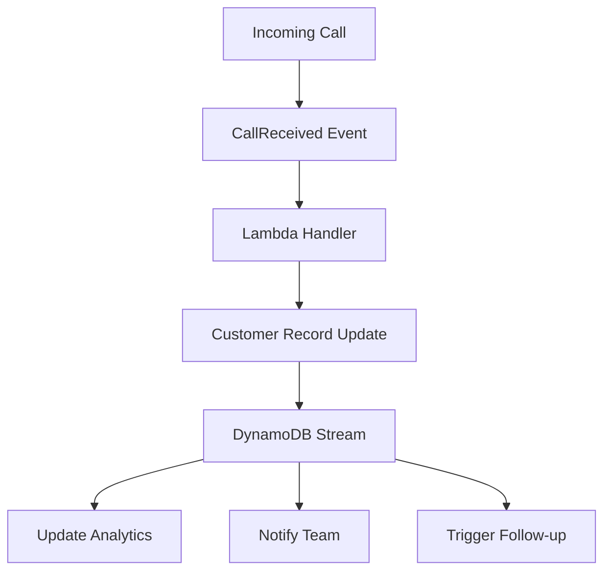

Building a startup in 2024 means having access to incredible tools that would have required entire teams to build just a few years ago. At [AskBenny](https://askbenny.ca/), we've carefully selected each piece of our tech stack to maximize our small team's impact. Here's what we chose and why.

## The Philosophy: Build vs. Buy vs. Integrate

Our approach is simple:

- **Build** what makes us unique (our AI answering service)
- **Buy** solved problems (analytics, chat, infrastructure)
- **Integrate** everything seamlessly

This lets us focus our engineering effort where it matters most.

## Analytics: PostHog – Understanding Without Invading

We chose PostHog for a critical reason: we need to understand how users interact with [AskBenny](https://askbenny.ca/) without compromising their privacy.

### What PostHog Gives Us:

**Product Analytics**

- User flows: How do businesses set up their AI receptionist?
- Feature adoption: Which features drive retention?
- Drop-off points: Where do users get stuck?

**Session Recordings**

- Watch real users navigate our platform
- Identify UX issues before customers complain
- Understand the "why" behind the numbers

**Feature Flags**

- Roll out new features gradually
- A/B test with real users
- Instant rollback if something breaks

**Surveys**

- In-app feedback at the right moment
- NPS scores to track satisfaction
- Qualitative insights to complement quantitative data

The killer feature? Everything runs on our infrastructure. Customer data never leaves our control.

## Customer Communication: Crisp – More Than Just Chat

For a lean team, customer communication can't be an afterthought. Crisp became our command center for customer relationships.

### Why Crisp Works for Us:

**Unified Inbox**

- Chat, email, and social media in one place
- Jordan manages all customer touchpoints efficiently
- No context switching between platforms

**Automation with a Human Touch**

- Smart routing based on customer type
- Automated responses for common questions
- But always with the option for human intervention

**Knowledge Base Integration**

- Customers self-serve for simple questions
- Reduces support load without sacrificing quality
- SEO benefits as a bonus

**Real-Time Collaboration**

- I can jump into technical conversations instantly
- Sydney sees customer feedback for ad optimization
- Jordan maintains relationship continuity

## Infrastructure: SST + AWS – Fully Serverless, Event-Driven, Beautiful


We went all-in on serverless with SST.dev as our infrastructure-as-code framework. This decision transformed how we build and deploy.

### Why SST Changed Everything

SST isn't just another IaC tool – it's designed specifically for serverless applications:

- **Live Lambda Development**: Debug Lambda functions locally with breakpoints
- **Type-Safe Infrastructure**: Our infrastructure and code share types
- **Zero-Config Deploys**: Git push → Production with built-in CI/CD

### Our Serverless Stack:

**Database: DynamoDB with Stream Triggers**

- Single-table design for all our entities
- DynamoDB Streams trigger dependent updates automatically
- Pay-per-request pricing aligns with our growth
- Instant scaling from 0 to millions of requests

**Message Queue: SQS**

- Decouple our services for reliability
- Handle call processing asynchronously
- Built-in retry logic and dead letter queues
- Perfect for our event-driven architecture

**Compute: Lambda Functions**

- No servers to manage or patch
- Automatic scaling based on demand
- Pay only for actual execution time
- Cold starts optimized with proper bundling

**Storage: S3**

- Call recordings stored securely
- Automatic lifecycle policies for cost optimization
- CloudFront CDN for global distribution
- Event triggers for processing pipelines

## Event-Driven Architecture: Mimicking the Real World

Our system models real-world interactions through events:

### How Events Flow Through [AskBenny](https://askbenny.ca/)



This architecture means:

- **Every action has a traceable event**
- **Systems stay loosely coupled**
- **Failures are isolated and retryable**
- **Real-world processes map directly to code**

### Example: When a Call Completes

1. Lambda processes the call → publishes `CallCompleted` event to SQS
2. DynamoDB updates customer record → triggers stream event
3. Stream processor updates analytics, sends notifications
4. All happening asynchronously, all retryable, all scalable

## Monitoring: CloudWatch + SST Console

Observability is crucial when running serverless:

### SST Console: Our Mission Control

The SST Console gives us:

- **Real-time function logs** across all services
- **Live tail of DynamoDB operations**
- **Visual event flow tracking**
- **One-click access to any resource**

### CloudWatch: Deep Insights

We've set up:

- **Custom metrics** for business KPIs (calls answered, average duration)
- **Alarms** for anomaly detection (spike in failed calls)
- **Dashboards** combining technical and business metrics
- **Log Insights** queries for debugging specific issues

### The Power of Infrastructure as Code

With SST, our entire infrastructure is:

```typescript
new Table(stack, "Customers", {
  stream: "new_and_old_images",
  consumers: {
    analytics: "functions/analytics.handler",
    notifications: "functions/notify.handler",
  },
});
```

Type-safe, version-controlled, and reviewable like any other code.

## The Glue: Modern Development Tools

Beyond the big three, several tools keep everything running smoothly:

**Deployment: SST on AWS**

- Single command deployment: `sst deploy`
- Infrastructure and application code deploy together
- Staging environments for testing changes
- Instant rollbacks with CloudFormation
- Type-safe deployments catch errors at build time

**Domain Management: Cloudflare**

- DNS managed through Cloudflare for reliability
- SSL certificates automatically provisioned
- DDoS protection and CDN included
- API for programmatic DNS updates

**Monitoring: Sentry**

- Catch errors before customers report them
- Performance monitoring to maintain speed
- Integrates with our development workflow

**Communication: Linear + Discord**

- Linear for task tracking (minimal overhead)
- Discord for real-time communication
- GitHub for code collaboration

## Cost Breakdown: Pay for What You Use

Our serverless architecture means costs scale perfectly with usage:

- **PostHog**: Self-hosted on our infrastructure
- **Crisp**: $95/month for team features
- **AWS Serverless**: ~$300/month currently
  - DynamoDB: $0 for first 25GB + pay-per-request
  - Lambda: First 1M requests free monthly
  - SQS: $0 for first 1M requests
  - Only paying for actual usage, not idle resources
- **Other tools**: ~$100/month combined

The beauty of serverless: our infrastructure costs were almost nothing during development and now scale linearly with revenue.

## Integration Magic: Making It All Work Together

The real power comes from integration:


Example flow:

1. New customer signs up (PostHog tracks)
2. Crisp automatically sends onboarding message
3. Jordan gets notification for personal follow-up
4. Sydney sees high-value lead alert
5. I monitor technical onboarding success

## Lessons Learned

### 1. Start Simple, Upgrade When Needed

We began with free tiers and upgraded only when limits became constraints.

### 2. Prioritize Developer Experience

Tools that slow us down get cut, no matter how feature-rich.

### 3. Data Privacy Matters

Choosing tools that respect customer privacy builds trust and ensures compliance.

### 4. Integration > Features

A tool that integrates well beats a feature-rich island every time.

## What We'd Do Differently

If starting today, we'd:

- Start with SST from day one (we migrated after a few weeks)
- Design for events first, not add them later
- Set up structured logging immediately
- Use DynamoDB single-table design from the beginning

## The Future Stack

As we scale, we're evaluating:

- **EventBridge** for more complex event routing
- **Step Functions** for multi-step workflows
- **Kinesis** for real-time streaming analytics
- **AppSync** for real-time customer dashboards

The serverless ecosystem keeps improving, and we're positioned to adopt new services as they mature.

## Your Stack Decisions Matter

Every tool choice either accelerates or hinders your progress. Our stack enables three people to serve hundreds of businesses reliably. What could the right tools enable for your team?

The best stack isn't the most advanced – it's the one that lets you focus on what makes your product unique.

---

_Next up: Customer success in the early days – why supporting your first users intensely is the key to sustainable growth._
