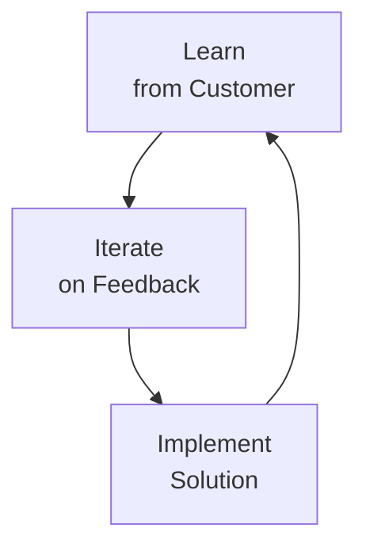
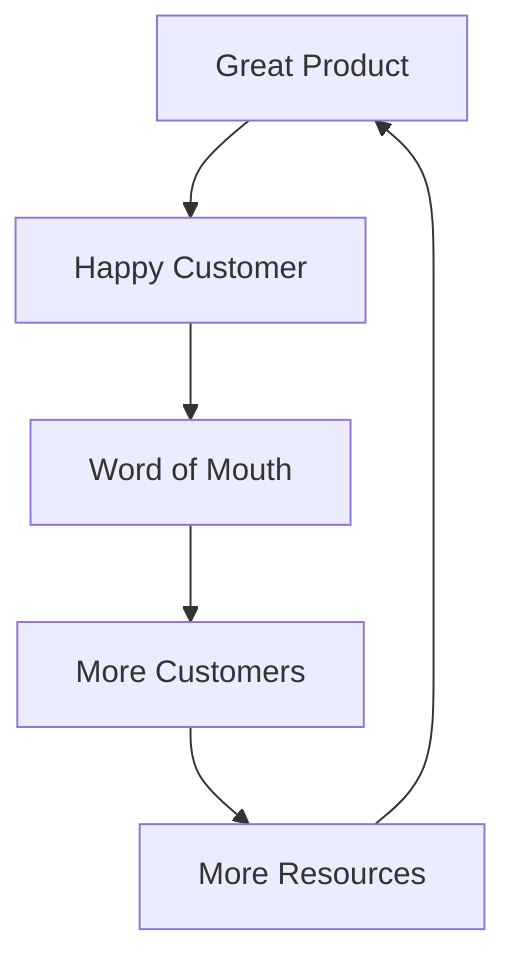

I've been reflecting on what it actually takes to win in the startup game. It's not just about having a flashy idea or the cleanest code. It's about a fundamental process of discovery, execution, and resilience. Here is what I've learnt so far.

## 1. Find Real Customer Pain Points

First, you need to find a real customer pain point.

The best ideas often don't come from brainstorming sessions; they come from your own negative experiences in day-to-day life. Pay attention to the things that frustrate you, the processes that feel broken, or the services that are just plain bad. Those visceral moments of "there has to be a better way" are often the seeds of the best startups.

If you feel the pain, chances are, someone else does too.

## 2. Don't Go It Alone

You need a team, or at the very least, a co-founder.

Building a startup is a lonely journey. It is incredibly difficult to do it alone. You need someone to be in the grind with you, riding the roller coaster of ups and downs. It's a major plus if they compliment your skill set, like a technical founder pairing with a sales/marketing expert.

Having someone to share the burden makes the hard days manageable and the wins that much sweeter.

## 3. The MVP and The First Customer

Once you've found the pain point, build an MVP (Minimum Viable Product).

**It doesn't have to be perfect.** In fact, it shouldn't be.

Do things that don't scale. Your goal isn't to launch to millions; it's to land **one paying customer** outside of your friends and family circle who actually experiences the pain point you are trying to solve.

Build for that specific customer. Listen to their feedback obsessively. Iterate with them.

## 4. The Learn-Iterate-Implement Loop

Once you have that first customer, build out the solution for them and gradually expand the feature set. Then, find more customers who have that exact same pain point and repeat the process.

This is the **Learn → Iterate → Implement** loop.

You must be ruthless about prioritization. Only build the features that make the most sense and deliver the highest value. Don't get distracted by "nice-to-haves."

## 5. The New Differentiators: Support & Distribution

With AI, building a decent product has become easier than ever. The barrier to entry for engineering has lowered. So, what sets you apart?

**Customer Support and Distribution.**

**Customer Support:** Make your customers feel genuinely supported. Help them immediately if they are having issues. When customers feel heard and cared for, churn drops significantly. In the early days, your support _is_ your brand.

**Distribution:** You have to find the right channels to find your customers. Be creative. Try socials, ads, cold outreach, try any and everything to get in front of them.

## The Flywheel

If your product is good enough to solve an actual customer problem, and your customer support is there to back it up, the flywheel starts to kick in.

You'll see momentum build. Word of mouth spreads. Growth accelerates.

Winning isn't about a single magic moment; it's about consistently executing on these fundamentals and refusing to give up.

